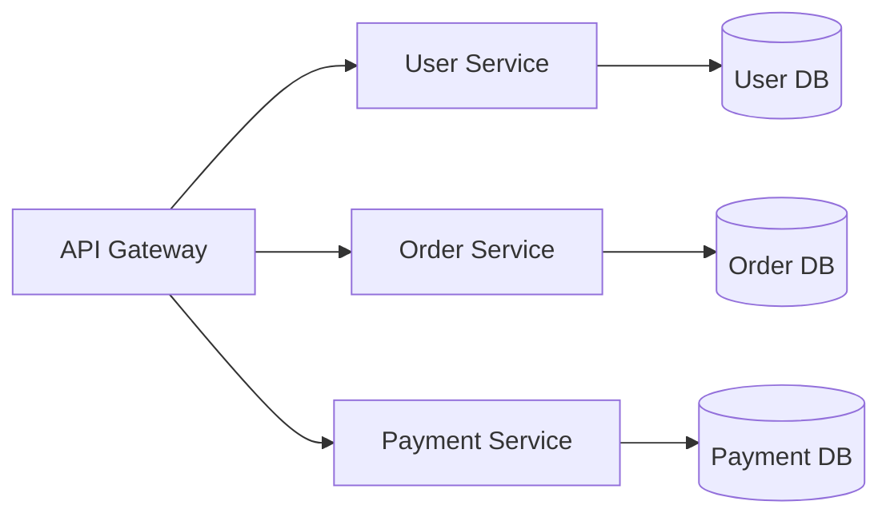

# ◇ Microservices and Event-Driven Architecture (EDA)

## ▪ Microservices Pattern

A microservices architecture structures an application as a collection of small, autonomous, and loosely coupled services. Each service represents a specific business capability and owns its own database (Database-per-Service).

### Core Principles
1. **Autonomy:** Each service can be developed, deployed, and scaled independently.
2. **Database-per-Service:** Services must not access each other's databases directly. Instead, they interact via public APIs.
3. **Decentralized Governance:** Teams can choose the best technology stack for their specific service's needs.

---

## ▪ Event-Driven Architecture (EDA)

In event-driven architectures, services communicate asynchronously by publishing and consuming events representing changes in state.

*   **Event:** An immutable statement of fact about something that has occurred (e.g., `OrderPlaced`, `PaymentCompleted`).
*   **Producer:** The service that generates and publishes an event.
*   **Consumer:** A service that subscribes to and processes events.

### Saga Pattern: Orchestration vs. Choreography
Managing distributed transactions across multiple databases to maintain eventual consistency:

*   **Orchestration:** A central coordinator service (Orchestrator) tells each participant which local transaction to execute. If a step fails, the orchestrator triggers compensating transactions.
    *   *Pros:* Centralized control, easy to trace execution flows.
    *   *Contras:* Heavy coupling to the coordinator; risk of the orchestrator becoming a logical monolith.
*   **Choreography:** Each service executes its local transaction and publishes events. Other services listen to those events and perform their tasks independently.
    *   *Pros:* Highly decoupled, no single point of failure in execution logic.
    *   *Contras:* Harder to debug and trace the global state of the transaction.

---

## ▪ Message Brokers: Kafka vs. RabbitMQ

| Feature | Apache Kafka | RabbitMQ |
| :--- | :--- | :--- |
| **Architecture** | Distributed commit log. | Traditional message queue with smart routing. |
| **Message Persistence** | Messages are persisted to disk and can be replayed. | Messages are usually deleted immediately after delivery. |
| **Consumer Model** | Pull-based (Consumers read at their own pace). | Push-based (Broker pushes to active consumers). |
| **Primary Use Cases** | Event streaming, real-time analytics, event sourcing. | Task queues, routing complex messages to specific workers. |

---

## ▪ Key Architectural Considerations

*   **Transactional Outbox Pattern:** To prevent inconsistencies where a database write succeeds but publishing the corresponding event fails, write the event to an `Outbox` table in the same database transaction. A separate publisher service polls this table and sends events to the broker.
*   **Consumer Idempotency:** Networks can duplicate messages. Consumers must be designed to handle the same event multiple times without side effects (e.g., checking if an order has already been processed before debiting a user's wallet).
