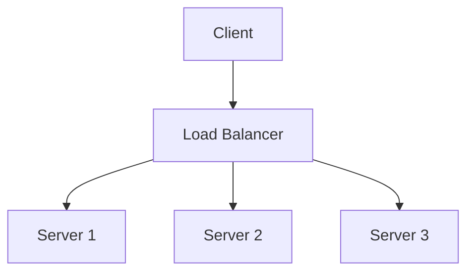

# ◇ Vertical vs. Horizontal Scaling

## ▪ Vertical Scaling (Scale-Up)

Vertical scaling involves adding more resources (CPU cores, RAM, storage) to a single existing server.

### Characteristics
*   **Simple Implementation:** Does not require changes to the application architecture.
*   **Hardware Limits:** Bound by physical hardware capacities available on a single machine.
*   **Exponential Cost:** Upgrading high-end servers becomes exponentially more expensive than purchasing multiple basic machines.
*   **Single Point of Failure (SPOF):** If the single server fails, the entire application goes offline.

---

## ▪ Horizontal Scaling (Scale-Out)

Horizontal scaling involves adding more servers of standard specifications (commodity hardware) to the pool.

### Characteristics
*   **Highly Scalable:** Allows adding servers dynamically as traffic increases.
*   **High Availability:** If one server fails, the load balancer reroutes traffic to the remaining servers.
*   **Stateless Requirement:** Application servers must be stateless (no local session state) so any incoming request can be processed by any node interchangeably.

---

## ▪ Database Scaling Strategies

Scaling stateless application servers is straightforward. Scaling stateful databases requires different patterns:

1. **Read Replicas (Leader-Follower):** A primary server (Leader) processes all write requests and replicates updates to helper servers (Followers). Read requests are routed to the followers. Ideal for read-heavy workloads.
2. **Database Sharding (Horizontal Partitioning):** Dividing database tables horizontally across independent database servers (Shards) based on a partition key.
3. **Database Scale-Up:** Allocating larger virtual machines or database instances (temporary and costly solution).

---

## ▪ Key Architectural Considerations

*   **Designing Stateless Application Layers:** To enable seamless scale-out, avoid saving user sessions or files on local server filesystems or memory. Instead, delegate session storage to centralized, fast in-memory key-value databases like **Redis**, or use self-contained client-side tokens like cryptographically signed JSON Web Tokens (JWTs).
