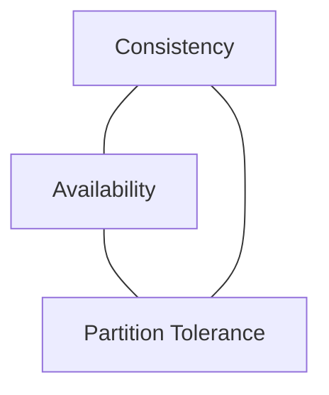

# ◇ CAP and PACELC Theorems

## ▪ The CAP Theorem

The CAP Theorem states that a distributed data system can simultaneously guarantee at most two of the following three properties:

1. **Consistency (C):** Every read receives the most recent write or an error. All nodes see the same data at the same time.
2. **Availability (A):** Every non-failing node returns a response for every request (without guaranteeing it contains the most recent write).
3. **Partition Tolerance (P):** The system continues to operate despite arbitrary network partition faults or dropped connections between nodes.

### The Real-World Dilemma (CP vs. AP)
In network deployments, **network partitions are inevitable (P)**. Therefore, when a partition occurs, system designers must choose between:

*   **CP (Consistency & Partition Tolerance):** The system rejects read/write requests on disconnected nodes to prevent inconsistent data. Prioritizes accuracy over uptime.
*   **AP (Availability & Partition Tolerance):** The system processes reads/writes on any available node, even if partitioned. Prioritizes uptime over immediate consistency, leading to eventual consistency.

---

## ▪ The PACELC Theorem

The CAP theorem only describes system behavior during network partition failures (P). The PACELC theorem extends this by analyzing tradeoffs during normal operating conditions (Else).

> **P**artition ? ( **A**vailability vs. **C**onsistency ) : **E**lse ( **L**atency vs. **C**onsistency )

If there is a **P**artition, how does the system behave? (**A**vailability vs. **C**onsistency).
**E**lse (under normal conditions), how does the system trade off **L**atency (L) vs. **C**onsistency (C)?

*   **PC/EC Systems (e.g., Google Spanner, Relational Databases):** Choose Consistency (C) during partitions. During normal operations, they choose Consistency (C) over low Latency (L), waiting for multi-node consensus before confirming writes.
*   **PA/EL Systems (e.g., Cassandra, DynamoDB):** Choose Availability (A) during partitions. During normal operations, they prioritize low Latency (L) over Consistency (C) by responding to the client immediately before replicating to all nodes.

---

## ▪ Key Architectural Considerations

*   **Tunable Consistency:** Systems like Apache Cassandra allow designers to tune consistency on a per-query basis. By configuring replication write/read parameters (e.g., setting `Write: QUORUM` and `Read: QUORUM`), a system can operate with strong consistency (CP behavior) under normal conditions, showing that CAP limits can be dynamically adjusted through software configurations.
