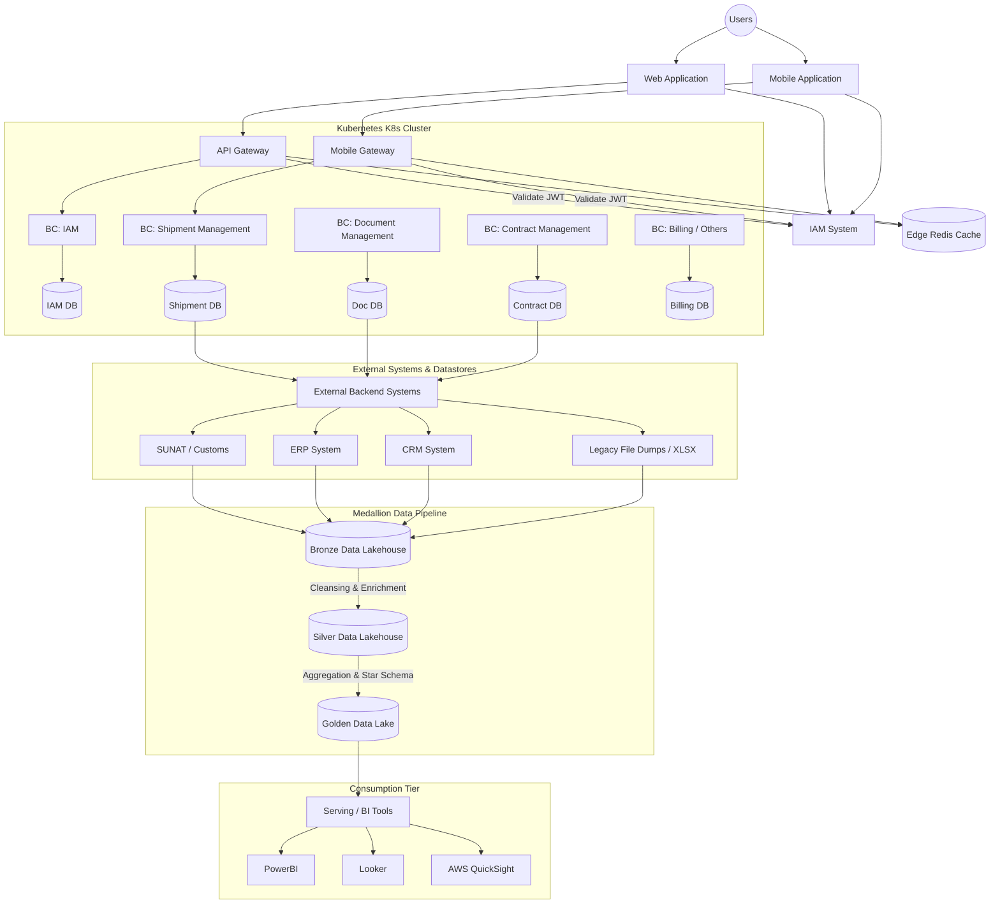

# ◇ Medallion & Enterprise Data Architecture

This document outlines the end-to-end enterprise system design, detailing user authentication routing, Kubernetes microservices, external system interfaces, and the Medallion Data Lakehouse pipeline.

---

## ▪ End-to-End System Blueprint

The enterprise system is divided into three primary layers: the Application Client & API Edge, the Containerized Business Services Tier, and the Analytic Medallion Pipeline.

---

## ▪ Layer 1: Client & API Edge

1. **Authentication & Authorization (IAM):** The Identity & Access Management system handles credentials, role-based access control (RBAC), permission mappings, and client application registration.
2. **API & Mobile Gateways:** All incoming user requests pass through dedicate Gateways (API GW & Mobile GW). Gateways perform token verification (JWT validation) against the IAM system before routing traffic to backend services.
3. **Edge Caching:** A **Redis** cluster is placed at the gateway level to cache session metadata, route maps, and transient configurations to reduce query overheads.

---

## ▪ Layer 2: Business Core (Kubernetes Cluster)

Services are packaged into independent containers and managed inside a Kubernetes (K8s) cluster. The architecture adheres to **Domain-Driven Design (DDD)** principles:
*   **Bounded Contexts (BCs):** Business units are isolated into dedicated contexts, such as:
    *   *IAM Context:* Manages account lifecycles and scopes.
    *   *Shipment Management Context (Gestión Embarques):* Manages shipping logistics.
    *   *Document Management Context (Gestión Documental):* Manages document ingestion and retrieval.
    *   *Contract Management Context (Gestión Contratos):* Manages client-vendor legal contracts.
*   **Database-per-Service:** Each Bounded Context owns its schema/database, preventing database-level coupling.

---

## ▪ Layer 3: External & Operational Data Sinks

Transactional databases feed data or coordinate state changes with external systems and core business backends:
*   **SUNAT / Customs:** Government validation structures.
*   **ERP & CRM Systems:** Legacy databases and CRM interfaces recording company resource allocations and customer history.
*   **Flat Files (XLSX):** Batch exports from offline environments.

---

## ▪ Layer 4: Analytics Medallion Architecture

Data from transactional systems and external resources is ingested into a Lakehouse pipeline divided into three distinct validation stages:

### 1. Bronze Layer (Raw Ingestion)
*   **Purpose:** Lands raw, unmodified source data directly from transaction logs, APIs, and file exports.
*   **Design:** Append-only schema preservation. Contains history of all operations, including updates and deletes as raw delta records. No validation checks are run.

### 2. Silver Layer (Cleaned & Enriched)
*   **Purpose:** Standardizes raw records to create an enterprise-wide view of domain concepts.
*   **Design:** Processes raw Bronze data through cleaning steps:
    *   *Data Cleansing:* Deduplicates rows, handles missing/null values, and corrects formatting errors.
    *   *Enrichment:* Normalizes schema definitions and casts data types.

### 3. Gold Layer (Business Ready)
*   **Purpose:** Powers reporting, metrics computation, and business analytics.
*   **Design:** Aggregates Silver datasets into specialized schemas (e.g., Star Schema with Facts and Dimensions) optimized for querying speed. 

---

## ▪ Layer 5: Consumption Tier (Serving Layer)

Business-ready structures in the **Gold Data Lake** are exposed directly to Business Intelligence (BI) applications to generate reports and drive operational decisions:
*   **PowerBI**
*   **Looker**
*   **AWS QuickSight**
