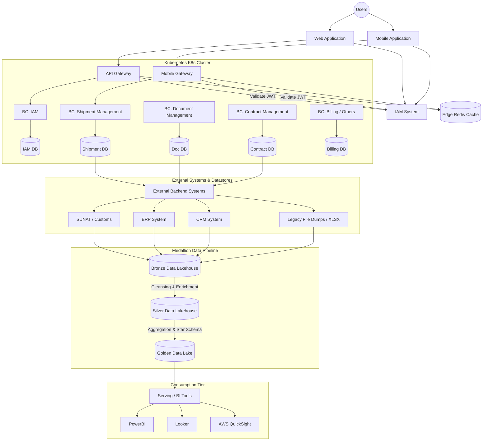

# ◇ Medallion & Enterprise Data Architecture

This document outlines the end-to-end enterprise system design, detailing user authentication routing, Kubernetes microservices, external system interfaces, and the Medallion Data Lakehouse pipeline.

---

## ▪ End-to-End System Blueprint

The enterprise system is divided into three primary layers: the Application Client & API Edge, the Containerized Business Services Tier, and the Analytic Medallion Pipeline.

---

## ▪ Layer 1: Client & API Edge

1. **Authentication & Authorization (IAM):** The Identity & Access Management system handles credentials, role-based access control (RBAC), permission mappings, and client application registration.
2. **API & Mobile Gateways:** All incoming user requests pass through dedicated [API Gateways](file:///d:/u/system-design-blueprint/GLOSSARY.md#api-gateway). Gateways perform token verification ([JWT](file:///d:/u/system-design-blueprint/GLOSSARY.md#jwt-json-web-token) validation) against the IAM system before routing traffic to backend services.
3. **Edge Caching:** A [Redis](file:///d:/u/system-design-blueprint/GLOSSARY.md#redis) cache cluster is placed at the gateway level to cache session metadata, route maps, and transient configurations to reduce query overheads.

<b>🔍 Design Notes & Clarifications</b>

*   **JWT Verification Offloading:** Gateways check token signatures cryptographically using cached public keys. They do not request verification from the IAM database on every call, avoiding a performance bottleneck.
*   **Edge Cache Strategy:** Redis is configured with an active expiration TTL (Time-To-Live). Cache invalidations are pushed via Pub/Sub from the IAM service when user privileges change.
*   *Add your custom notes, validations, or configurations here...*

---

## ▪ Layer 2: Business Core (Kubernetes Cluster)

Services are packaged into independent containers and managed inside a [Kubernetes](file:///d:/u/system-design-blueprint/GLOSSARY.md#kubernetes-k8s) cluster. The architecture adheres to [Domain-Driven Design](file:///d:/u/system-design-blueprint/GLOSSARY.md#domain-driven-design-ddd) principles:
*   **[Bounded Contexts](file:///d:/u/system-design-blueprint/GLOSSARY.md#bounded-context) (BCs):** Business units are isolated into dedicated contexts, such as:
    *   *IAM Context:* Manages account lifecycles and scopes.
    *   *Shipment Management Context (Gestión Embarques):* Manages shipping logistics.
    *   *Document Management Context (Gestión Documental):* Manages document ingestion and retrieval.
    *   *Contract Management Context (Gestión Contratos):* Manages client-vendor legal contracts.
*   **[Database-per-Service](file:///d:/u/system-design-blueprint/GLOSSARY.md#database-per-service):** Each Bounded Context owns its schema/database, preventing database-level coupling.

<b>🔍 Design Notes & Clarifications</b>

*   **Database Isolation Boundaries:** Direct SQL connections between different microservice containers are forbidden. All data exchange is performed via public APIs (REST/gRPC) or events.
*   **Transactional Autonomy:** If an action spans multiple contexts, they achieve eventual consistency using event streaming rather than distributed two-phase commit transactions.
*   *Add your custom notes, namespace configurations, or microservice interaction details here...*

---

## ▪ Layer 3: External & Operational Data Sinks

Transactional databases feed data or coordinate state changes with external systems and core business backends:
*   **SUNAT / Customs:** Government validation structures.
*   **[ERP](file:///d:/u/system-design-blueprint/GLOSSARY.md#erp-enterprise-resource-planning) & [CRM](file:///d:/u/system-design-blueprint/GLOSSARY.md#crm-customer-relationship-management) Systems:** Legacy databases and CRM interfaces recording company resource allocations and customer history.
*   **Flat Files (XLSX):** Batch exports from offline environments.

<b>🔍 Design Notes & Clarifications</b>

*   **Legacy Sync Decoupling:** Integrating with legacy ERPs is handled via background message queues. Gateway request threads do not wait synchronously for slow ERP API responses.
*   **File Drop Directory:** The file-based XLSX sink uses a scheduled cron job that picks up files and converts them into JSON streams before ingestion into the data lake.
*   *Add your custom notes on legacy system endpoints or data mapping models here...*

---

## ▪ Layer 4: Analytics Medallion Architecture

Data from transactional systems and external resources is ingested into a [Lakehouse](file:///d:/u/system-design-blueprint/GLOSSARY.md#lakehouse) pipeline divided into three distinct validation stages of the [Medallion Architecture](file:///d:/u/system-design-blueprint/GLOSSARY.md#medallion-architecture):

### 1. Bronze Layer (Raw Ingestion)
*   **Purpose:** Lands raw, unmodified source data directly from transaction logs, APIs, and file exports.
*   **Design:** Append-only schema preservation. Contains history of all operations, including updates and deletes as raw delta records. No validation checks are run.

### 2. Silver Layer (Cleaned & Enriched)
*   **Purpose:** Standardizes raw records to create an enterprise-wide view of domain concepts.
*   **Design:** Processes raw Bronze data through cleaning steps:
    *   *Data Cleansing:* Deduplicates rows, handles missing/null values, and corrects formatting errors.
    *   *Enrichment:* Normalizes schema definitions and casts data types.

### 3. Gold Layer (Business Ready)
*   **Purpose:** Powers reporting, metrics computation, and business analytics.
*   **Design:** Aggregates Silver datasets into specialized schemas (e.g., [Star Schema](file:///d:/u/system-design-blueprint/GLOSSARY.md#star-schema) with Facts and Dimensions) optimized for querying speed. 

<b>🔍 Design Notes & Clarifications</b>

*   **Storage and Partitions:** Medallion data tables use the [Delta / Parquet Format](file:///d:/u/system-design-blueprint/GLOSSARY.md#delta-parquet-format) partitioned by transaction date to optimize scanning performance.
*   **Raw Traceability Rule:** The Bronze layer serves as the ultimate source of truth. If a transformation rule in the Silver or Gold layer is found to contain a bug, the tables can be rebuilt entirely by replaying the raw Bronze history.
*   *Add your custom notes on ETL tooling (Spark, dbt), execution schedules, or data catalogs here...*

---

## ▪ Layer 5: Consumption Tier (Serving Layer)

Business-ready structures in the Gold Data Lake are exposed directly to Business Intelligence (BI) applications to generate reports and drive operational decisions:
*   **PowerBI**
*   **Looker**
*   **AWS QuickSight**

<b>🔍 Design Notes & Clarifications</b>

*   **Query Access Policies:** Access to the Gold layer is governed by column-level encryption to hide sensitive customer data from general reporting roles.
*   **DirectQuery vs Import Thresholds:** Report developers should prefer data import mode for operational dashboards, and [DirectQuery](file:///d:/u/system-design-blueprint/GLOSSARY.md#directquery) only for real-time tracking dashboards that query large historical tables.
*   *Add your custom notes on BI user roles, gateway connections, or dashboard requirements here...*

---

> [!NOTE]
> Data analytic vs Data transactional

**Data analytic**
- Data analytical architecture focuses on **data transformation, storage, and retrieval for analytics**. It deals with historical perspective.
- Purpose: **Decision Support and Business Intelligence**
    * Analyzes business trends, patterns, and insights.
    * Supports strategic decision-making through reporting and dashboards.
- Data Structure: **Denormalized**
    * Typically uses Star Schema or Snowflake Schema for optimized query performance.
    * Optimized for read performance and complex analytical queries.
- Performance Metrics:
    * **Latency:** High latency for data ingestion (minutes to hours).
    * **Query Time:** Fast query response times (seconds to minutes).
    * **Data Volume:** Large volumes of historical data (terabytes to petabytes).   

**Data transactional**
- Data transactional architecture focuses on **data storage and retrieval for transactions**. It deals with current perspective.
- Purpose: **RecordKeeping and Transaction Processing**
    * Captures day-to-day business operations (sales, orders, payments, inventory changes).
    * Maintains data integrity and atomicity through ACID properties.
- Data Structure: **Normalized**
    * Typically uses 3NF (Third Normal Form) to minimize redundancy and ensure data consistency.
    * Optimized for write performance and complex queries.
- Performance Metrics:
    * **Latency:** Low latency for INSERT, UPDATE, DELETE operations (milliseconds).
    * **Concurrency:** High concurrency to handle many simultaneous transactions.
    * **Throughput:** High throughput measured in transactions per second (TPS).

---

> [!IMPORTANT]
> Why Medallion Architecture?
> Why is important to use all this process to analyze data?

1. **Data quality:** By processing data through multiple layers, we can ensure that the data is clean and accurate.
2. **Data governance:** By using a medallion architecture, we can ensure that the data is properly governed.
3. **Data lineage:** By using a medallion architecture, we can track the lineage of the data as it flows through the system.
4. **Data security:** By using a medallion architecture, we can ensure that the data is properly secured.
5. **Data can be use for differents purposes:** Data can be used for different purposes, such as **analytics**, **machine learning**, and **business intelligence**.
6. **Data can be used for real-time processing:** Data can be processed in real-time as it flows through the system.

---

## ▪ Casos de Estudio y Aplicaciones Reales

Para comprender cómo se aplica la arquitectura Medallón en escenarios empresariales complejos con restricciones de negocio, rendimiento y regulatorias, consulta los siguientes casos de uso:

*   **[Caso Práctico: Banco Finanzas Perú (Riesgo Crediticio)](file:///d:/Jorge/system-design-blueprint/03-data-tier-architecture/cases/case-medallion-architecture.md)**
    *   *Objetivo:* Reducir el tiempo de evaluación crediticia de 72 horas a menos de 15 minutos.
    *   *Desafíos:* Ingestión de datos legados (AS/400), streaming en tiempo real (App Móvil), rate-limiting estricto (API SBS/INFOCORP) y cumplimiento regulatorio (retención de 5 años).
