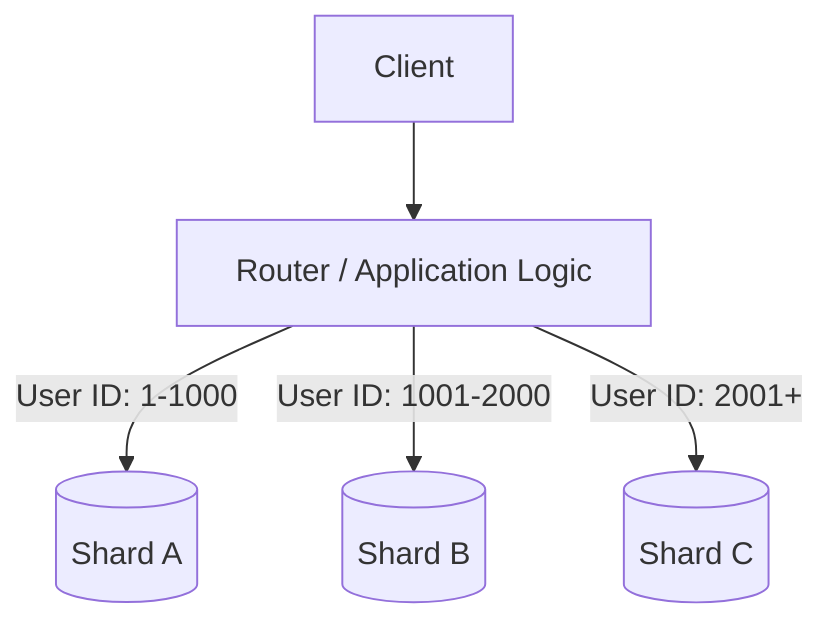
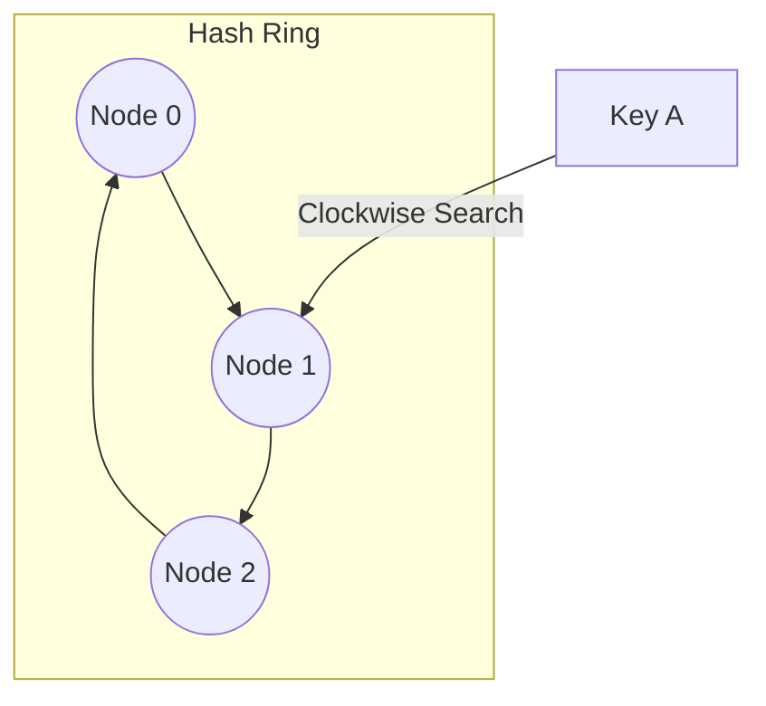

# ◇ Replication and Sharding

To achieve high availability and scalability at the data layer, databases employ replication and horizontal sharding.

---

## ▪ Replication Models (High Availability)

Replication involves storing copies of the same data across multiple physical server nodes.

### 1. Leader-Follower Replication (Master-Slave)
*   **Mechanism:** All write operations go to a single primary server (Leader). The leader propagates updates to secondary servers (Followers) synchronously or asynchronously. Reads can be served by any follower.
*   **Pros:** Highly efficient for read-heavy systems.
*   **Cons:** If the leader fails, a failover mechanism must elect a new leader. Writes remain bottlenecked by the single leader node.

### 2. Multi-Leader Replication
*   **Mechanism:** Multiple nodes act as leaders, processing both reads and writes.
*   **Pros:** High write availability and redundancy.
*   **Cons:** Complex conflict resolution strategies are required if concurrent writes occur on different leader nodes for the same data.

---

## ▪ Sharding (Horizontal Partitioning)

Sharding breaks down a large database table into smaller, self-contained units called **shards**. Each shard operates as an independent database instance storing a subset of the rows.

### Partition Key (Shard Key)
The field that determines which shard receives a specific row of data.
*   **Optimal Shard Key:** Distributes data and query load evenly across shards (e.g., `user_id`).
*   **Suboptimal Shard Key:** Leads to **Hotspots** (heavily loaded shards while others remain idle). For example, sharding by `created_at` timestamp causes all current writes to hit the same shard.

---

## ▪ Consistent Hashing

With traditional modulo-based partitioning (`hash(key) % N`), changing the server pool size `N` (adding or removing a database node) invalidates the mapping, forcing a redistribution of nearly 100% of the keys.

**Consistent Hashing** resolves this by placing both keys and server nodes on a logical, circular hash ring.

*   **Mechanism:** When a node is added or removed, **only a small fraction** of keys ($K/N$, where $K$ is the total keys and $N$ is the number of servers) must be remapped to different servers.
*   **Virtual Nodes (Vnodes):** Maps physical servers to multiple locations on the ring, ensuring uniform load distribution and preventing partition imbalance.

---

## ▪ Key Architectural Considerations

*   **Cross-Shard Joins:** Querying and joining data across multiple shards is highly inefficient. Avoid this by denormalizing data models or pre-aggregating related entities within the same shard.
*   **Loss of Referential Integrity:** Maintaining foreign key constraints across independent database shards is generally unsupported. Implement validation checks at the application service layer.
