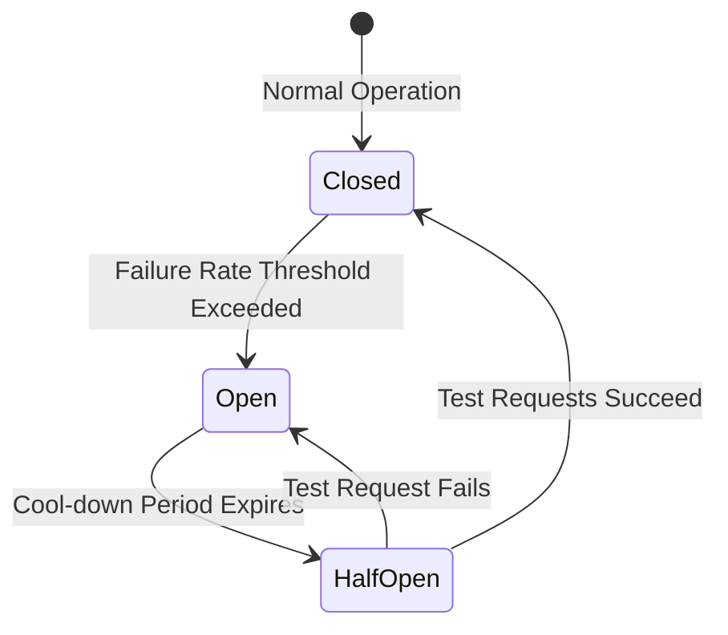

# ◇ Fault Tolerance and Resilience

Distributed systems must be designed under the assumption that network and host failures are inevitable. Architectures should isolate and handle failures gracefully to prevent cascading outages.

---

## ▪ Circuit Breaker Pattern

The Circuit Breaker pattern prevents an application from repeatedly executing an operation that is highly likely to fail, shielding downstream services from resource exhaustion.

*   **Closed:** Requests pass through normally. The system tracks failures (timeouts, 5xx errors).
*   **Open:** If the failure rate crosses a threshold (e.g., 50% errors over 10 seconds), the circuit trips. Requests fail immediately (*fail-fast*) without invoking the downstream service.
*   **Half-Open:** After a cool-down period, the circuit permits a limited number of test requests. If they succeed, the circuit closes. If any fail, it trips back to Open.

---

## ▪ Rate Limiting Pattern

Rate limiting restricts the volume of requests a user or client can make within a specified timeframe, protecting servers against denial of service (DoS) and traffic spikes.

### Common Algorithms
1. **Token Bucket:** A bucket holds up to $N$ tokens. Each incoming request consumes one token. Tokens replenish at a constant rate $R$. If the bucket is empty, requests are discarded (returning HTTP 429). Supports bursty traffic.
2. **Leaky Bucket:** Requests enter a FIFO queue and are processed at a constant output rate. If the queue overflows, incoming requests are rejected. Smooths out traffic spikes.
3. **Fixed Window Counter:** Divides time into fixed windows (e.g., 1 minute). Counts requests per window. If requests exceed limits, they are blocked until the next window. Vulnerable to traffic bursts at window boundaries.
4. **Sliding Window Log/Counter:** Tracks request timestamps inside a moving window, smoothing out boundary bursts.

---

## ▪ Graceful Degradation

Graceful degradation ensures that when critical services fail, the system falls back to a limited but operational state rather than crashing entirely.

### Examples
*   **Recommendation Failovers:** If user-specific recommendation services crash, the system falls back to displaying a pre-computed list of popular items.
*   **E-Commerce Checkout:** If real-time inventory systems respond too slowly, checkout pipelines accept orders anyway and process inventory verification asynchronously.

---

## ▪ Key Architectural Considerations

*   **Retry Storms:** When downstream services experience transient failures, naive retries from clients can compound the issue and create a self-inflicted denial of service.
    *   *Exponential Backoff:* Scale retry wait times exponentially (e.g., 1s, 2s, 4s, 8s).
    *   *Jitter:* Inject random noise into retry intervals to desynchronize requests, preventing retry stampedes from hitting recovering servers at the exact same millisecond.
