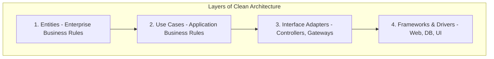
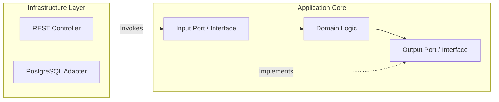

# ◇ Clean & Hexagonal Architecture

Clean and Hexagonal architectures decouple core business logic from framework details, databases, user interfaces, and third-party libraries.

---

## ▪ Clean Architecture

Popularized by Robert C. Martin (Uncle Bob), Clean Architecture uses concentric circles representing different layers of software. The primary rule is the **Dependency Rule**: dependencies must only point inwards. Code in internal circles must have no knowledge of external circles.

---

## ▪ Hexagonal Architecture (Ports and Adapters)

Introduced by Alistair Cockburn, Hexagonal Architecture isolates the application core (Domain and Use Cases) from external infrastructure. Interactions pass through boundaries called **Ports** (interfaces) and **Adapters** (implementations).

### Core Architecture Components
*   **Input Ports:** Interfaces defining how the external world interacts with the core application (e.g., Use Case interfaces called by HTTP Controllers or CLI commands).
*   **Output Ports:** Interfaces defining how the core application queries or updates external systems (e.g., a `UserRepositoryInterface` or a `NotificationPort`).
*   **Adapters:** Code translating protocols between external resources and Ports.
    *   *Primary (Driving) Adapters:* Controllers, Event listeners, and UI components calling Input Ports.
    *   *Secondary (Driven) Adapters:* DB repositories, cloud file storages, or SMS gateways implementing Output Ports.

---

## ▪ Key Architectural Considerations

*   **Dependency Inversion (D in SOLID):** Apply Dependency Inversion to prevent business logic from depending on infrastructure code. For instance, place the `PaymentGatewayInterface` (Output Port) in the core layer. Create a `StripePaymentGateway` class (Adapter) inside the infrastructure layer that implements that interface. At runtime, inject the Stripe implementation into the Use Case. This decoupling allows switching vendors (e.g., from Stripe to PayPal) without changing core business logic.
