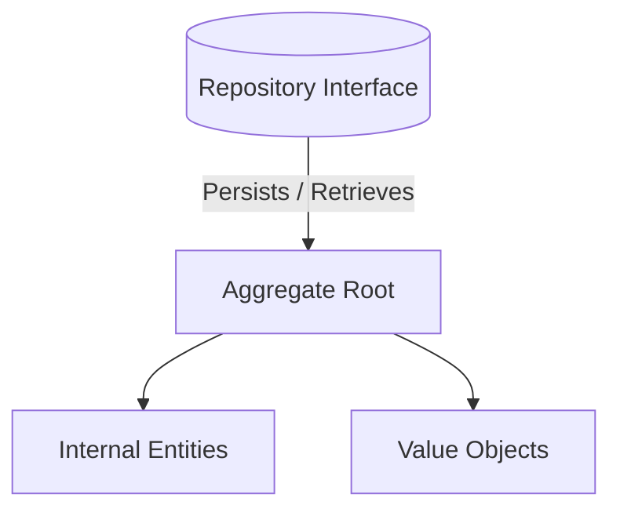

# ◇ Domain-Driven Design (DDD)

Domain-Driven Design is an approach to software development centering development on a deeply-modeled business domain.

---

## ▪ Strategic Design

Strategic design establishes boundaries, context mappings, and team alignments in complex systems.

### 1. Ubiquitous Language
A common, rigorous language shared by software developers and business domain experts. All codebase terms, database schemas, and documentation must match this terminology exactly. For instance, if business experts refer to the process as "Product Despatch", the code should use `ProductDespatch` rather than `ShippingInfo`.

### 2. Bounded Context
A boundary wrapping a specific domain model. It isolates semantic definitions. For example, a "Product" model in the **Sales** context focuses on price, catalog details, and availability. In the **Logistics** context, the "Product" model instead emphasizes weight, physical dimensions, and warehouse shelf location. Attempting to unify these into a single class causes model pollution and coupling.

---

## ▪ Tactical Design

Tactical design provides code patterns to model the domain state and behaviors within a Bounded Context.

*   **Entities:** Objects with a distinct identity that persists over time, independent of changes to their attributes (e.g., a `User` class defined by a unique ID, where emails or addresses can change, but the identity remains the same).
*   **Value Objects:** Immutable objects defined solely by their attributes, with no conceptual identity (e.g., a `Money` class containing `amount` and `currency`). Changing a value object requires creating a new instance.
*   **Aggregates:** A cluster of associated entities and value objects treated as a single transactional unit of state change. External access to the cluster is restricted through a single boundary entity called the **Aggregate Root**.
*   **Repositories:** Abstractions masquerading as in-memory collections used to persist and retrieve whole Aggregates.
*   **Domain Events:** Event notifications generated by an Aggregate indicating a state change of significance within the domain (e.g., `OrderCheckedOut`).

---

## ▪ Key Architectural Considerations

*   **Entities vs. Value Objects Comparison:**
    *   *Identity:* Entities are compared by their unique IDs. Value Objects are compared structural-value-wise; two Value Objects are identical if they have the exact same attributes.
    *   *Mutability:* Entities are mutable throughout their lifecycle. Value Objects are strictly immutable, which simplifies concurrency and avoids unintended side effects in downstream services.
