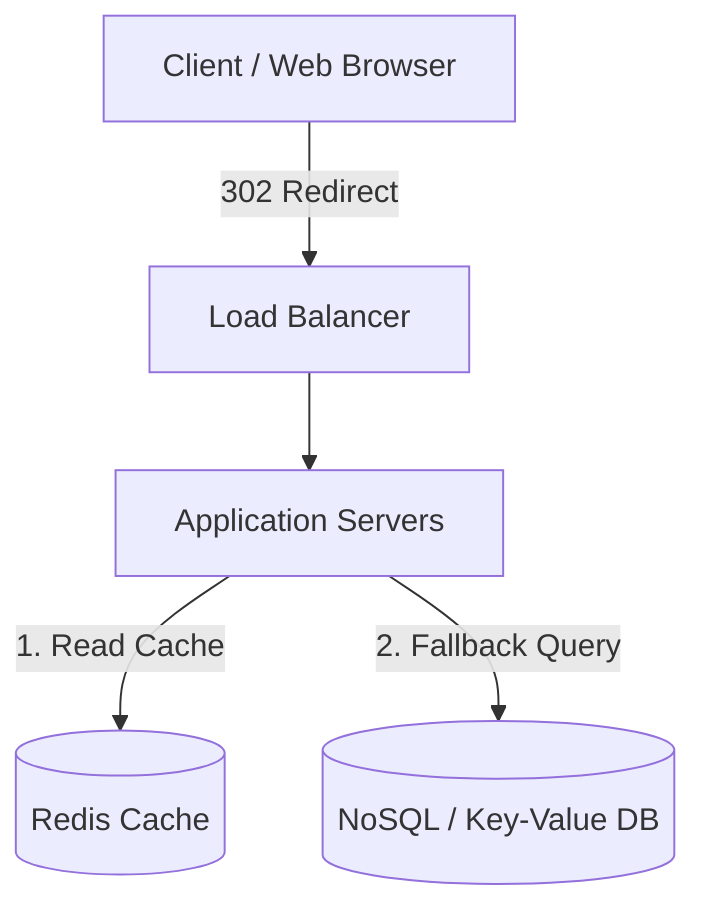
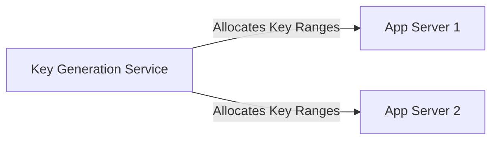

# ◇ System Design Case Study: URL Shortener

This document details the engineering architecture for a high-scale URL shortener service.

---

## ▪ Requirements Scoping

*   **Functional Requirements:**
    *   Given a long URL, generate a unique, shortened link (e.g., `short.ly/a9B7c1`).
    *   When accessing the short link, redirect the client to the original long URL.
    *   Allow users to set custom expiration dates (defaults to 2 years).
*   **Non-Functional Requirements:**
    *   Ultra-low latency redirections (Read latency < 100ms).
    *   High availability (99.99% uptime target).
    *   Shortened hashes must be non-sequential to prevent enumeration scraping attacks.

---

## ▪ Scale Estimations (Back-of-the-envelope)

*   **Traffic Scale:**
    *   100 million new URLs created per month.
    *   Read-to-Write Ratio = 10:1 (10 redirections for every 1 creation request).
    *   Write QPS (Creation): $100,000,000 / (30 \text{ days} \times 86400 \text{ seconds}) \approx 40$ writes/sec.
    *   Read QPS (Redirection): $40 \times 10 = 400$ reads/sec.
*   **Storage footprint (5-year projection):**
    *   Total URLs generated in 5 years: $100 \text{M} \times 12 \text{ months} \times 5 \text{ years} = 6 \text{ billion}$ records.
    *   Average record size (ID + shortened hash + long URL + timestamp): $500$ bytes.
    *   Total database storage: $6,000,000,000 \times 500 \text{ bytes} \approx 3$ Terabytes (TB).
*   **Memory Cache Capacity:**
    *   Cache the top 20% of daily active read requests (Pareto Principle 80/20 rule).
    *   Daily read requests: $400 \text{ QPS} \times 86400 \text{ seconds} \approx 34.5 \text{ million}$ daily hits.
    *   Required cache RAM: $34.5\text{M} \times 0.20 \times 500 \text{ bytes} \approx 3.45$ Gigabytes (GB).

---

## ▪ High-Level Architecture & Schema

### Database Schema
Since we store 6 billion simple key-value pairs without relational mapping requirements, a distributed NoSQL database (e.g., MongoDB, DynamoDB) is ideal for horizontal scalability.

**Table: `urls`**
*   `short_hash` (VARCHAR / Primary Key) - 7-character Base62 string.
*   `original_url` (VARCHAR) - Target redirect link.
*   `created_at` (TIMESTAMP) - Creation date.
*   `expires_at` (TIMESTAMP) - Expiration date.

---

## ▪ Architectural Deep Dive

### Short Hash Generation: Hashing vs. Key Generation Service (KGS)

#### Option A: Hashing (SHA-256 + Base62 truncation)
Apply SHA-256 to the long URL, encode the result in Base62 (`[a-zA-Z0-9]`), and take the first 7 characters (providing $62^7 \approx 3.5$ trillion unique permutations).
*   *Issue:* Hash collisions. Two different URLs might yield the same first 7 characters.
*   *Mitigation:* Check the database before insertion. If the hash exists, append a timestamp to the input and retry. This introduces database read latencies on every write.

#### Option B: Key Generation Service (KGS)
Introduce a decentralized, lightweight service that pre-generates unique numerical sequences.

1. KGS maintains a central sequence counter, distributing ranges of keys to application servers in memory (e.g., App Server 1 gets keys 1–10,000, App Server 2 gets keys 10,001–20,000).
2. Application servers convert numbers directly to Base62 values, guaranteeing unique hashes without database collision checks.
3. KGS uses Apache ZooKeeper or a highly available consensus store to coordinate range allocations securely.

### Redirection Status Codes: HTTP 301 vs. 302
*   **HTTP 301 (Moved Permanently):** The browser caches the redirection locally. Subsequent requests do not hit the shortener servers.
    *   *Trade-off:* Reduces server load but prevents real-time redirection click analytics collection.
*   **HTTP 302 (Found / Temporary):** The browser must query the shortener service for every redirection.
    *   *Trade-off:* Increases server traffic but allows tracking of real-time metrics (referrer, user agent, geolocations).

---

## ▪ System Trade-offs Summary

*   We selected **KGS** to bypass query overheads during write cycles.
*   We deployed **Redis** with an **LRU** eviction policy to cache active redirects, targeting read times under 10ms.
*   We implemented **HTTP 302 redirection** to prioritize analytics collection despite the higher query volume on the web tier.
