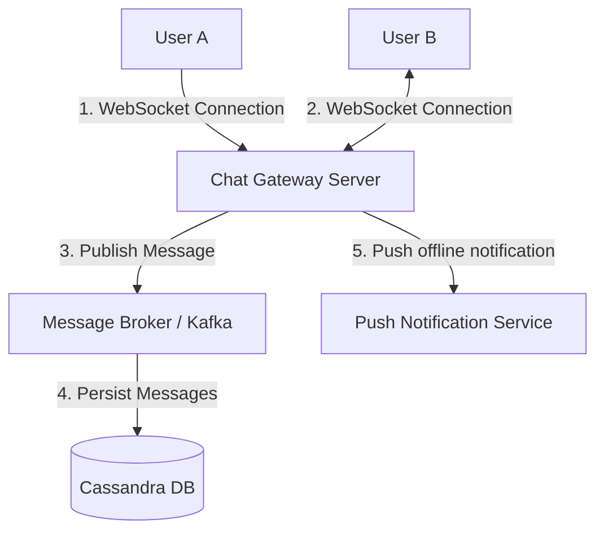
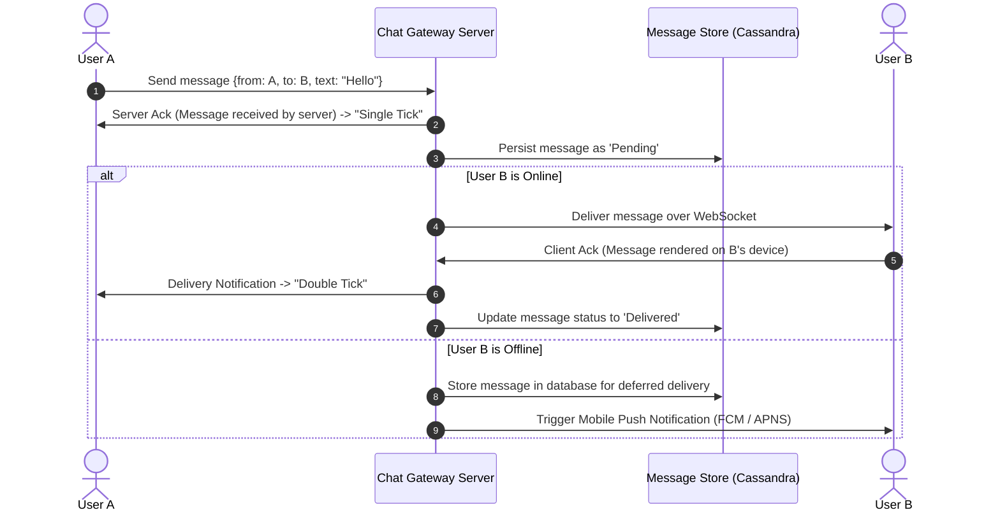

# ◇ System Design Case Study: Real-Time Messenger (WhatsApp Scale)

This document details the engineering architecture of a scalable real-time messaging system capable of supporting millions of active concurrent users.

---

## ▪ Requirements Scoping

*   **Functional Requirements:**
    *   One-to-one messaging with delivery status tracking (sent, delivered, read).
    *   Group chat capability (up to 500 participants).
    *   User presence states (online, offline, last active timestamp).
    *   Support for binary media payloads (images, video, documents).
*   **Non-Functional Requirements:**
    *   Low-latency message delivery (< 500ms).
    *   High availability and tolerance to transient connection drops.
    *   Eventual consistency for message synchronizations on offline-to-online transitions.

---

## ▪ High-Level Architecture

### Connection Protocols: WebSockets vs. HTTP
*   HTTP is pull-based, making real-time server-to-client updates inefficient (polling overhead).
*   **WebSockets** provides a persistent, full-duplex, bidirectional communication channel over a single TCP connection, ideal for low-latency messaging.
*   Alternative: **Server-Sent Events (SSE)** for downstream combined with HTTP POST for upstream. WebSockets remains the standard for symmetrical real-time data flows.

---

## ▪ Message Flow (1-to-1 Messaging)

---

## ▪ Architectural Deep Dive

### 1. Message Persistence: Cassandra (Wide-Column Store)
Real-time chat requires high-throughput write speeds.
*   **Cassandra** uses a log-structured merge-tree (LSM) structure, writing data sequentially to memory (MemTable) before flushing to disk (SSTable). This removes random-seek disk IO overhead.
*   **Partition Key:** `chat_id` (ensures all messages between User A and User B reside on the same physical database node).
*   **Clustering Key:** `message_id` or `created_at` (orders messages chronologically on disk, optimizing history scans).

### 2. Presence Status Management
*   **Heartbeat Mechanism:** Clients send a periodic ping (every 10s) over the WebSocket to notify availability.
*   **Storage Tier:** Use **Redis** for low latency.
    *   Key: `user_id`
    *   Value: `{status: "online", last_active: timestamp}` with a TTL of 15 seconds. If a heartbeat fails to arrive before the TTL expires, the status defaults to "offline".

### 3. Group Chats scaling
*   When a message is broadcasted to a group, the gateway must push it to all active participants.
*   For groups with $M$ members, the service resolves the membership directory, locates which gateway node holds each participant's active WebSocket, and forwards the payload.
*   *Optimization:* For large groups, message duplication is queued and processed asynchronously, decoupling delivery from the sender's upload thread.

---

## ▪ System Trade-offs Summary

*   **Eventual Consistency:** We choose eventual consistency for message delivery states (ticks) and presence status in exchange for horizontal throughput.
*   **Stateless Gateways:** Chat gateway servers do not hold persistent state; they route WebSocket connections. Active user-to-server mappings are stored in a distributed Redis session registry.
