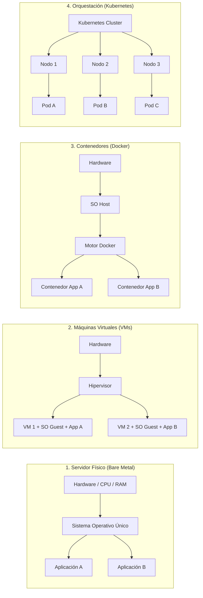
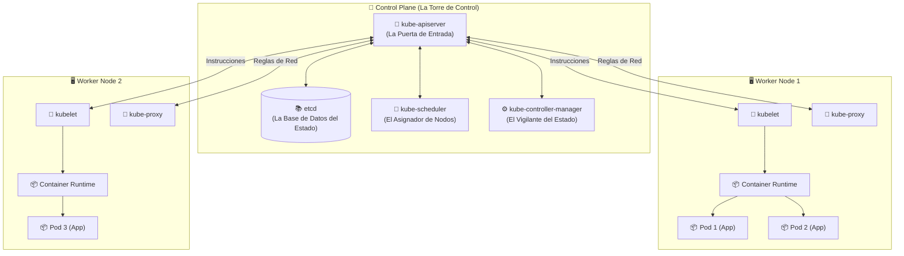
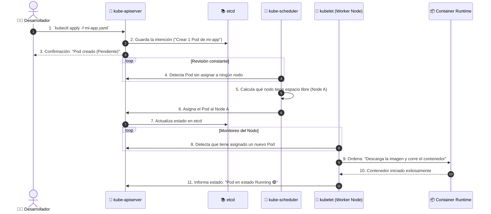

# ⎈ 01 - Introducción y Arquitectura de Kubernetes

Kubernetes (comúnmente llamado **K8s**) es una plataforma de código abierto diseñada para automatizar el despliegue, escalado y administración de aplicaciones en contenedores.

---

## 💡 ¿Por qué existe Kubernetes? (La Analogía del Puerto)

Imagina un puerto marítimo gigantesco:
* **Docker** son los **contenedores metálicos de carga**. Te permiten empaquetar una aplicación con todas sus dependencias para que funcione igual en cualquier lugar.
* **Kubernetes** es la **grúa automatizada, el puerto completo y la torre de control**. Se asegura de mover los contenedores, reemplazar los que se rompen, descargar la carga cuando hay mucho trabajo y controlar el tráfico marítimo.

### Evolución de la Infraestructura

---

## 🏛️ Arquitectura del Cluster: El Capataz y los Trabajadores

Un cluster de Kubernetes está dividido en dos partes principales:
1. **Control Plane (El Plano de Control / La Torre de Control):** Toma las decisiones inteligentes.
2. **Worker Nodes (Los Nodos de Trabajo):** Máquinas (físicas o virtuales) que realmente ejecutan tus aplicaciones.

---

## 🧩 Componentes Explicados Sencillamente

### 1. El Control Plane (Cerebro)

* **`kube-apiserver` (El Recepcionista):** Es el punto central de comunicación. Todo pasa por aquí, ya sea un comando escrito por un programador o una orden interna.
* **`etcd` (El Libro de Recuerdos):** Base de datos clave-valor ultrasegura donde Kubernetes guarda exactamente la foto del estado de todo el sistema (cuántos Pods existen, en qué servidores están, etc.).
* **`kube-scheduler` (El Asignador):** Revisa qué servidores (nodos) tienen suficiente CPU y memoria libre para ubicar las nuevas aplicaciones que queremos desplegar.
* **`kube-controller-manager` (El Vigilante):** Se encarga de comparar constantemente la realidad con lo deseado. Si le pediste 3 réplicas de una app y una se rompe, este componente detecta el fallo y ordena crear una nueva.

### 2. Los Worker Nodes (Los Servidores de Trabajo)

* **`kubelet` (El Capataz del Nodo):** Es un agente que corre en cada servidor de trabajo. Recibe instrucciones de la torre de control y asegura que los contenedores estén sanos y corriendo.
* **`kube-proxy` (El Guardia de Tráfico):** Gestiona la red dentro del nodo, configurando reglas IP para que los usuarios u otros servicios puedan conectarse a las aplicaciones.
* **`Container Runtime` (El Motor de Ejecución):** El software encargando de descargar y correr las imágenes de contenedor (usualmente `containerd`).

---

## 🔄 Ciclo de Vida Visual: ¿Qué pasa al ejecutar un comando?

Mira paso a paso lo que sucede cuando ejecutas el comando `kubectl apply -f mi-app.yaml`:

---

## 🔑 Términos Clave de esta Sección

* **[Control Plane](file:///d:/Jorge/system-design-blueprint/GLOSSARY.md#control-plane-plano-de-control):** El cerebro administrativo del cluster.
* **Worker Node:** Servidor donde corren físicamente las aplicaciones.
* **`kubectl`:** Herramienta de línea de comandos utilizada por los desarrolladores para enviarle instrucciones a Kubernetes.
