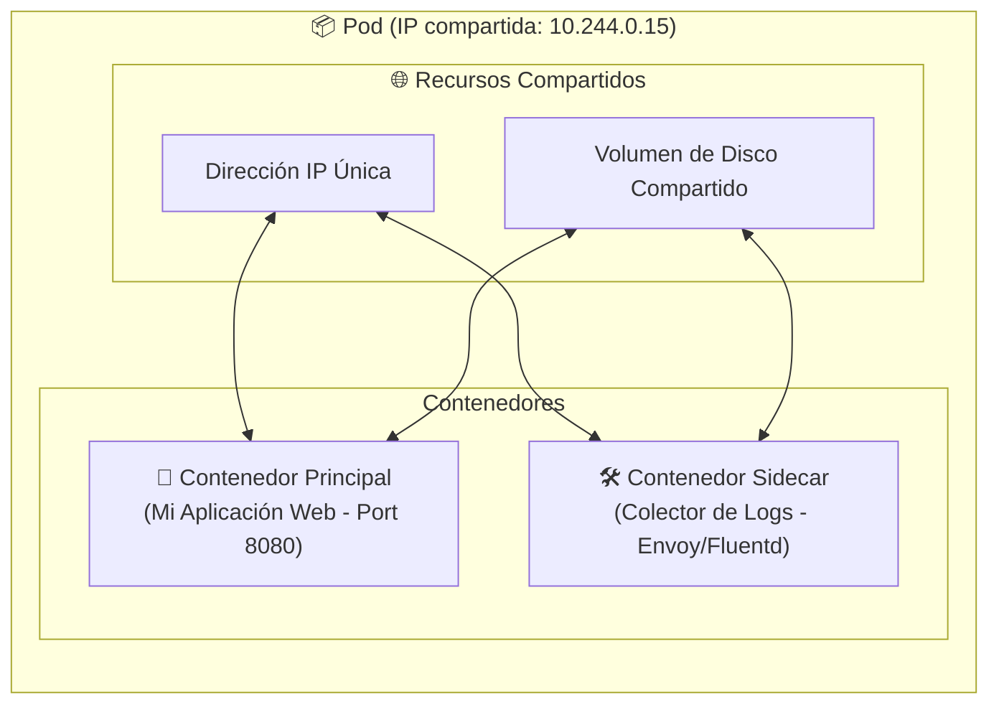
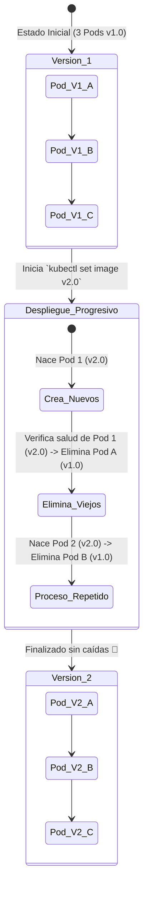
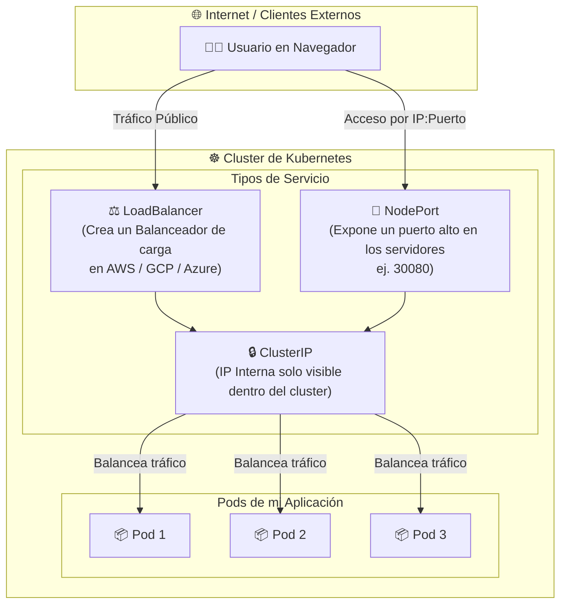
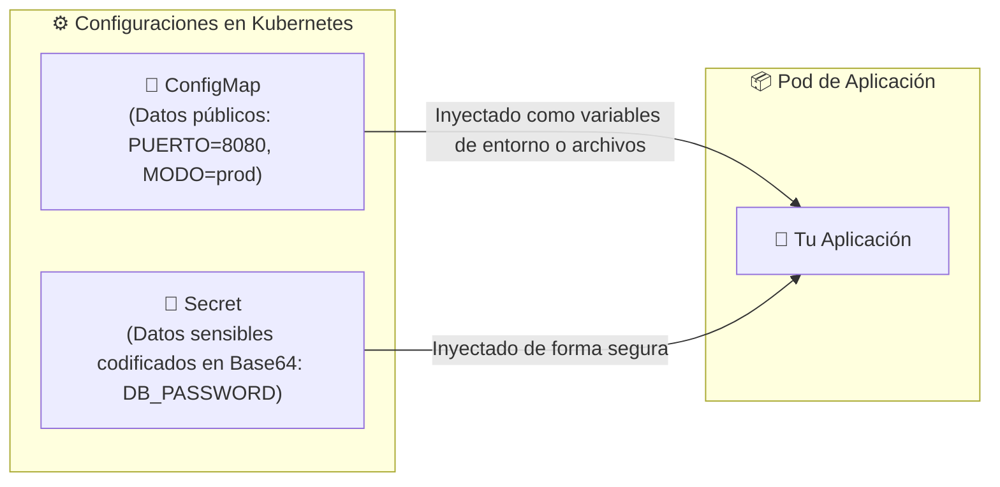

# 📦 02 - Objetos Básicos: Pods, Deployments y Services

Para trabajar con Kubernetes no manipulamos contenedores directamente. En su lugar, utilizamos **Objetos de Kubernetes** definidos mediante archivos YAML.

---

## 1. El Pod: La Unidad Mínima de Kubernetes

Un **Pod** es la envoltura o cápsula más pequeña que puedes crear en Kubernetes. Generalmente contiene un solo contenedor (tu aplicación), pero a veces puede llevar contenedores secundarios auxiliares llamados **Sidecars** (por ejemplo, para enviar logs o métricas).

### Anatomía Interna de un Pod



> 💡 **Regla de oro:** Todos los contenedores dentro de un mismo Pod comparten la misma red (se leen por `localhost`) y pueden compartir el mismo almacenamiento.

---

## 2. Deployments: Garantizando Autorrecuperación y Escala

Si creas un Pod individual y el servidor físico falla, ese Pod muere para siempre. Por eso, en producción nunca creamos Pods sueltos; utilizamos un **Deployment**.

Un **Deployment** se encarga de:
1. Mantener encendida la cantidad exacta de réplicas que pidas.
2. Reemplazar Pods destruidos automáticamente.
3. Actualizar la versión de tu código **sin interrumpir el servicio (Zero-Downtime)**.

### Estrategia de Actualización Sin Caídas (Rolling Update)



---

## 3. Services (Servicios): Redes y Descubrimiento

Los Pods son **efímeros**: nacen, mueren y al renacer cambian de IP. ¿Cómo hacen otras aplicaciones o usuarios para conectarse a ellos si sus direcciones IP cambian todo el tiempo?

La respuesta es un **Service (Servicio)**. Un Servicio funciona como un **punto de contacto fijo y balanceador de carga interno**.

### Tipos de Servicios en Kubernetes



* **`ClusterIP` (Por defecto):** Otorga una IP fija **solo accesible desde dentro del cluster**. Ideal para bases de datos o servicios internos.
* **`NodePort`:** Abre un puerto específico (entre 30000 y 32767) directamente en todas las máquinas de tu cluster.
* **`LoadBalancer`:** Se conecta con tu proveedor de nube (AWS ALB, GCP Load Balancer) para otorgarte una IP pública oficial.

---

## 4. ConfigMaps y Secrets: Desacoplando Configuraciones

Nunca debes hardcodear contraseñas, URLs de bases de datos o claves API dentro de la imagen de tu contenedor.



* **`ConfigMap`:** Almacena variables de entorno, archivos de configuración `.env` o `.json` en texto plano.
* **`Secret`:** Almacena datos confidenciales (tokens, llaves SSH, contraseñas de bases de datos).

---

## 📄 Ejemplo Práctico de Manifiesto YAML

A continuación se muestra cómo se define un **Deployment** y un **Service** en un único archivo declarativo:

```yaml
# 1. Definición del Servicio
apiVersion: v1
kind: Service
metadata:
  name: mi-servicio-web
spec:
  type: ClusterIP
  ports:
    - port: 80          # Puerto expuesto por el Servicio
      targetPort: 8080  # Puerto donde escucha el Pod internamente
  selector:
    app: mi-web-app     # Busca los Pods con esta etiqueta

---
# 2. Definición del Deployment
apiVersion: apps/v1
kind: Deployment
metadata:
  name: mi-deployment-web
spec:
  replicas: 3           # Queremos 3 Pods exactamente iguales
  selector:
    matchLabels:
      app: mi-web-app
  template:
    metadata:
      labels:
        app: mi-web-app
    spec:
      containers:
        - name: contenedor-web
          image: nginx:alpine
          ports:
            - containerPort: 8080
```
