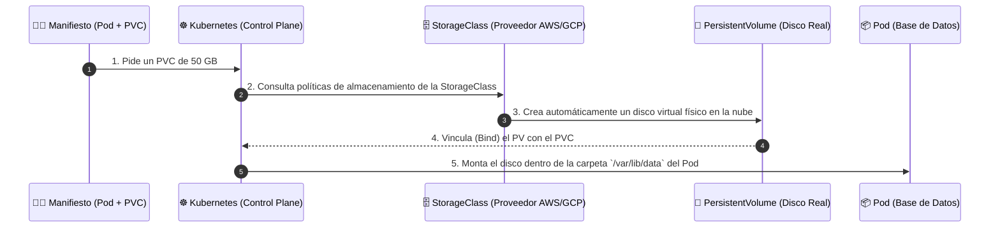
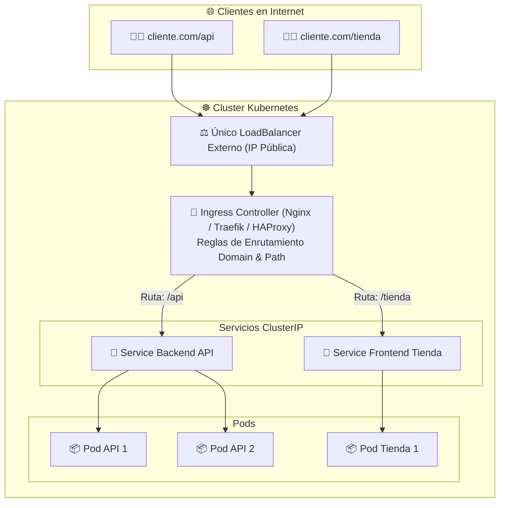

# 💾 03 - Almacenamiento Persistente y Redes Avanzadas

En los módulos anteriores aprendimos que los Pods son efímeros. Si un Pod con una base de datos se destruye y renace, **¿qué ocurre con los datos guardados en el disco?** Si no usamos almacenamiento persistente, ¡los datos se borran por completo!

---

## 1. Almacenamiento Persistente (PV, PVC y StorageClass)

Kubernetes resuelve la persistencia de datos separando la **solicitud del usuario** de la **provisión física del almacenamiento**.

### La Analogía del Ticket de Guardarropa

* **`StorageClass` (El Catálogo de Discos):** Es como un menú que ofrece los tipos de almacenamiento disponibles (ej. SSD ultrarrápido, Disco Mecánico Barato, Almacenamiento en la Nube AWS EBS).
* **`PersistentVolumeClaim` - PVC (El Ticket de Solicitud):** Es la petición que hace el desarrollador diciendo: *"Necesito un disco de 50GB tipo SSD"*.
* **`PersistentVolume` - PV (El Disco Físico Real):** Es el bloque de almacenamiento real reservado y conectado al servidor.

### Flujo de Solicitud y Montaje de Almacenamiento



---

## 2. Ingress Controller: Enrutamiento Avanzado HTTP/HTTPS

Aunque un `Service` de tipo `LoadBalancer` nos da una IP pública, crear un LoadBalancer por cada microservicio en la nube es **extremadamente costoso**.

Para solucionar esto existe **Ingress**. Funciona como un **Enrutador Inteligente HTTP/HTTPS** de nivel 7 (L7) que utiliza un solo LoadBalancer externo para redirigir el tráfico a múltiples servicios según el dominio o la ruta de la URL.

### Arquitectura con Ingress Controller



> 🔐 **Beneficio extra:** Ingress también se encarga de gestionar los **certificados SSL/TLS (HTTPS)** de forma centralizada.

---

## 3. Service Mesh (Malla de Servicios)

Cuando una arquitectura crece a decenas o cientos de microservicios, surgen nuevos retos:
* ¿Cómo ciframos todas las comunicaciones internas entre servicios (mTLS)?
* ¿Cómo medimos la latencia exacta entre el Servicio A y el Servicio B?
* ¿Cómo hacemos pruebas de tráfico (Canary releases) enviando el 10% de los usuarios a una versión de prueba?

Una **Service Mesh** (como **Istio** o **Linkerd**) resuelve esto agregando un pequeño contenedor auxiliar (*Proxy Envoy*) al lado de cada Pod.

```mermaid
graph LR
    subgraph Pod_A["📦 Pod Servicio A"]
        AppA["🚀 App A"] <-->|Localhost| ProxyA["🛡️ Envoy Proxy"]
    end

    subgraph Pod_B["📦 Pod Servicio B"]
        ProxyB["🛡️ Envoy Proxy"] <-->|Localhost| AppB["🚀 App B"]
    end

    ProxyA <===="🔒 Comunicación Cifrada (mTLS) + Tracing + Telemetría"====> ProxyB
```

---

## 📄 Ejemplo YAML: Ingress y PersistentVolumeClaim

```yaml
# 1. Petición de Almacenamiento de 10GB
apiVersion: v1
kind: PersistentVolumeClaim
metadata:
  name: pvc-base-datos
spec:
  accessModes:
    - ReadWriteOnce   # El disco solo puede ser montado por un Pod a la vez
  resources:
    requests:
      storage: 10Gi
  storageClassName: gp2-ssd

---
# 2. Regla de Enrutamiento Ingress
apiVersion: networking.k8s.io/v1
kind: Ingress
metadata:
  name: ingress-principal
spec:
  rules:
    - host: mi-empresa.com
      http:
        paths:
          - path: /api
            pathType: Prefix
            backend:
              service:
                name: servicio-backend
                port:
                  number: 80
          - path: /
            pathType: Prefix
            backend:
              service:
                name: servicio-frontend
                port:
                  number: 80
```
