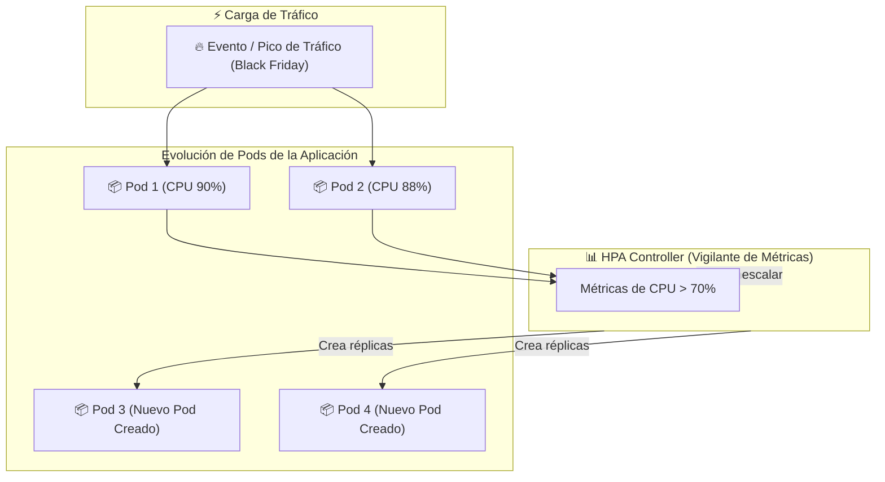
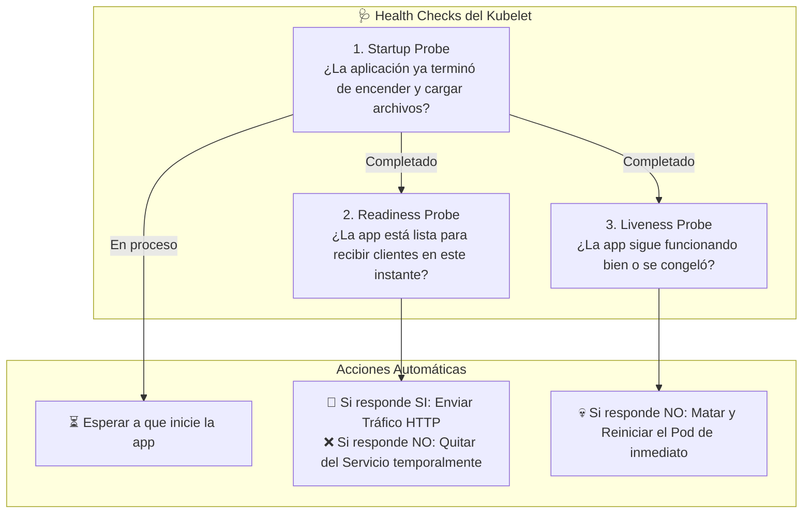
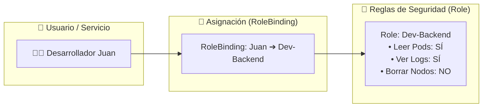

# 📈 04 - Escalabilidad, Resiliencia y Seguridad

Una de las mayores fortalezas de Kubernetes es su capacidad para **autoescalar la infraestructura automáticamente** en momentos de alta demanda y garantizar que las aplicaciones con fallos se recuperen de inmediato sin intervención humana.

---

## 1. Autoescalado Automático (Autoscaling)

Kubernetes escala a tres niveles diferentes:

### A. Horizontal Pod Autoscaler (HPA)
Monitorea continuamente métricas como el consumo de CPU, memoria o solicitudes entrantes. Si el consumo supera un umbral (ej. 70% CPU), crea más réplicas del Pod. Cuando el tráfico baja, destruye los Pods sobrantes.



### B. Cluster Autoscaler y Karpenter (Escalado de Nodos)
Si el HPA intenta crear nuevos Pods pero **los servidores físicos (nodos) ya no tienen memoria disponible**, el **Cluster Autoscaler** o **Karpenter** le pide automáticamente al proveedor de nube (AWS, GCP, Azure) que encienda un nuevo servidor e instale las dependencias de inmediato.

---

## 2. Health Checks y Revisiones Médicas (Probes)

¿Cómo sabe Kubernetes si tu aplicación está viva, lista para recibir clientes o si se quedó "congelada" en un bucle infinito? Lo hace usando tres tipos de revisiones automáticas (**Probes**):



---

## 3. Clases de Calidad de Servicio (QoS) y Límites de Recursos

Para evitar que una sola aplicación consuma toda la memoria del servidor y haga colapsar a las demás, debemos especificar **Resource Requests** (lo mínimo que necesita para encender) y **Resource Limits** (lo máximo que se le permite consumir).

```yaml
resources:
  requests:
    memory: "256Mi"   # Reserva garantizada de memoria
    cpu: "250m"       # 0.25 núcleos de CPU
  limits:
    memory: "512Mi"   # Si la app supera los 512MB, K8s la mata con error OOMKilled (Out Of Memory)
    cpu: "500m"       # Limita el uso máximo de CPU
```

---

## 4. Seguridad y Control de Acceso (RBAC)

**RBAC (Role-Based Access Control)** define **quién** puede realizar **qué acciones** sobre **qué recursos** del cluster.



* **Role:** Conjunto de permisos dentro de un espacio de nombres (*Namespace*).
* **ClusterRole:** Conjunto de permisos globales en todo el cluster.
* **RoleBinding / ClusterRoleBinding:** El puente que vincula a un usuario o aplicación con un `Role` o `ClusterRole`.
