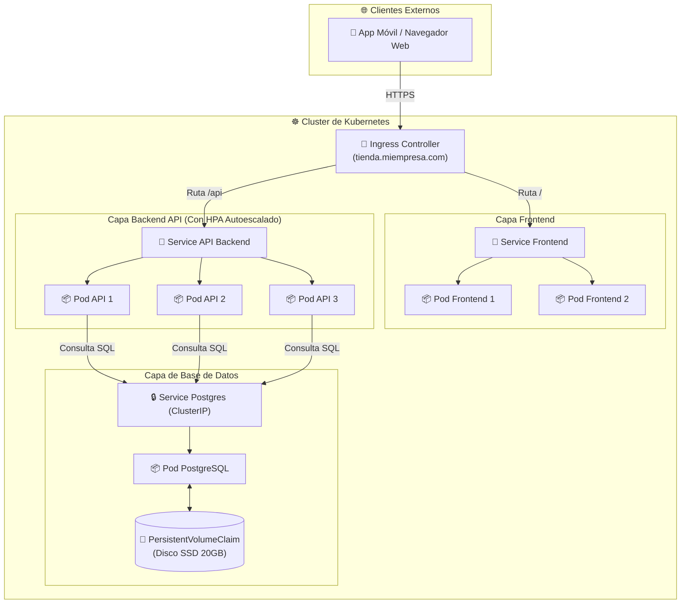

# 🛒 Caso Práctico: Despliegue de una Tienda en Línea en Kubernetes

En este caso práctico integraremos todos los conocimientos aprendidos para desplegar una aplicación completa en Kubernetes: una **Tienda en Línea de Alta Disponibilidad**.

---

## 🏛️ Arquitectura del Sistema

La arquitectura consta de tres capas:
1. **Acceso Externo (Ingress):** Enruta las peticiones de los usuarios.
2. **Capa Web / API (Deployments):** Frontend en Node.js y API Backend en Go con autoescalado (HPA).
3. **Capa de Persistencia (StatefulSet + PVC):** Base de datos PostgreSQL con almacenamiento persistente SSD.



---

## 📄 Manifiesto Completo Comentado (Listo para Probar)

Guarda este código en un archivo llamado `tienda-completa.yaml` y ejecútalo con `kubectl apply -f tienda-completa.yaml`:

```yaml
# ==========================================
# 1. BASE DE DATOS (POSTGRESQL + PERSISTENCIA)
# ==========================================
apiVersion: v1
kind: PersistentVolumeClaim
metadata:
  name: postgres-pvc
spec:
  accessModes:
    - ReadWriteOnce
  resources:
    requests:
      storage: 20Gi
---
apiVersion: v1
kind: Service
metadata:
  name: postgres-service
spec:
  type: ClusterIP
  ports:
    - port: 5432
  selector:
    app: postgres
---
apiVersion: apps/v1
kind: Deployment
metadata:
  name: postgres-deployment
spec:
  replicas: 1
  selector:
    matchLabels:
      app: postgres
  template:
    metadata:
      labels:
        app: postgres
    spec:
      containers:
        - name: postgres
          image: postgres:15-alpine
          env:
            - name: POSTGRES_PASSWORD
              value: "PasswordSuperSeguro123"
          ports:
            - containerPort: 5432
          volumeMounts:
            - name: postgres-storage
              mountPath: /var/lib/postgresql/data
      volumes:
        - name: postgres-storage
          persistentVolumeClaim:
            claimName: postgres-pvc

---
# ==========================================
# 2. CAPA BACKEND API (CON HEALTH CHECKS)
# ==========================================
apiVersion: v1
kind: Service
metadata:
  name: api-service
spec:
  type: ClusterIP
  ports:
    - port: 8080
  selector:
    app: api-backend
---
apiVersion: apps/v1
kind: Deployment
metadata:
  name: api-deployment
spec:
  replicas: 2
  selector:
    matchLabels:
      app: api-backend
  template:
    metadata:
      labels:
        app: api-backend
    spec:
      containers:
        - name: api-container
          image: nginx:alpine  # Imagen de ejemplo
          ports:
            - containerPort: 8080
          resources:
            requests:
              cpu: "100m"
              memory: "128Mi"
            limits:
              cpu: "250m"
              memory: "256Mi"
          livenessProbe:
            httpGet:
              path: /healthz
              port: 8080
            initialDelaySeconds: 5
            periodSeconds: 10
          readinessProbe:
            httpGet:
              path: /readiness
              port: 8080
            initialDelaySeconds: 2
            periodSeconds: 5

---
# ==========================================
# 3. AUTOESCALADO AUTOMÁTICO (HPA PARA API)
# ==========================================
apiVersion: autoscaling/v2
kind: HorizontalPodAutoscaler
metadata:
  name: api-hpa
spec:
  scaleTargetRef:
    apiVersion: apps/v1
    kind: Deployment
    name: api-deployment
  minReplicas: 2
  maxReplicas: 10
  metrics:
    - type: Resource
      resource:
        name: cpu
        target:
          type: Utilization
          averageUtilization: 70

---
# ==========================================
# 4. ENRUTAMIENTO INGRESS (ACCESO PÚBLICO)
# ==========================================
apiVersion: networking.k8s.io/v1
kind: Ingress
metadata:
  name: tienda-ingress
spec:
  rules:
    - host: tienda.miempresa.com
      http:
        paths:
          - path: /api
            pathType: Prefix
            backend:
              service:
                name: api-service
                port:
                  number: 8080
```
