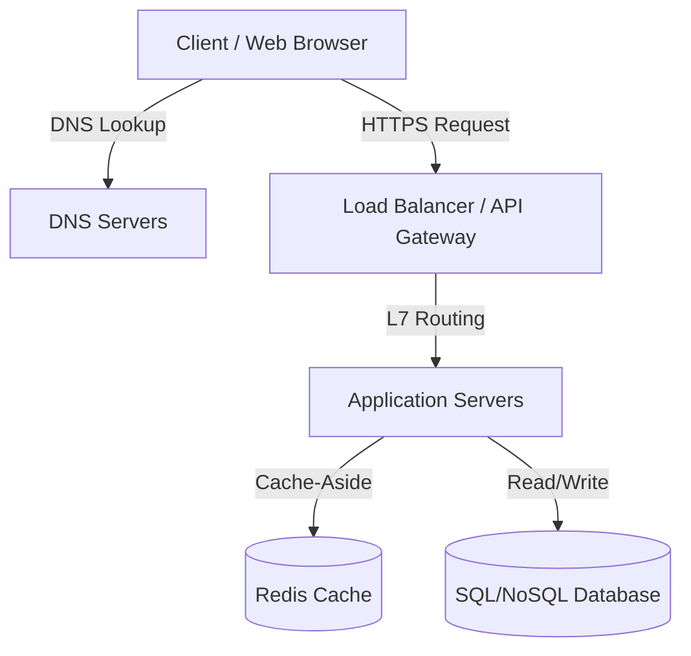

# // System Design & Software Architecture Blueprint

Welcome to your software architecture and system design knowledge base. This repository is designed to consolidate core design patterns, architectural styles, scalability strategies, and engineering blueprints.

---

## :: Roadmap & Table of Contents

Click on any of the links to navigate through the topics:

### ❖ [01-architectural-styles](file:///d:/u/system-design-blueprint/01-architectural-styles/)
*   **[Monoliths and SOA](file:///d:/u/system-design-blueprint/01-architectural-styles/monoliths-and-soa.md):** Traditional architectures, coupling, initial scalability, and transition to Service-Oriented Architecture.
*   **[Microservices and EDA](file:///d:/u/system-design-blueprint/01-architectural-styles/microservices-eda.md):** Domain decomposition, database-per-service patterns, choreography vs. orchestration, and message brokers.
*   **[Serverless and Peer-to-Peer](file:///d:/u/system-design-blueprint/01-architectural-styles/serverless-peer-to-peer.md):** Event-driven on-demand compute, scaling dynamics, and decentralized networks.

### ▲ [02-scalability-performance](file:///d:/u/system-design-blueprint/02-scalability-performance/)
*   **[Vertical vs. Horizontal Scaling](file:///d:/u/system-design-blueprint/02-scalability-performance/vertical-vs-horizontal.md):** Scale-up vs. Scale-out strategies, hardware constraints, and database partitioning.
*   **[Load Balancing](file:///d:/u/system-design-blueprint/02-scalability-performance/load-balancing.md):** Distribution algorithms and Layer 4 vs. Layer 7 routing.
*   **[Caching Strategies](file:///d:/u/system-design-blueprint/02-scalability-performance/caching-strategies.md):** CDNs, Redis/Memcached, read/write patterns, and eviction policies.

### ▪ [03-data-tier-architecture](file:///d:/u/system-design-blueprint/03-data-tier-architecture/)
*   **[SQL vs. NoSQL](file:///d:/u/system-design-blueprint/03-data-tier-architecture/SQL-vs-NoSQL.md):** Relational schemas vs. Document/Key-Value/Columnar/Graph models, and ACID vs. BASE.
*   **[CAP Theorem](file:///d:/u/system-design-blueprint/03-data-tier-architecture/cap-theorem.md):** Consistency, Availability, and Partition Tolerance tradeoffs, extended by PACELC.
*   **[Replication and Sharding](file:///d:/u/system-design-blueprint/03-data-tier-architecture/replication-sharding.md):** High availability configurations, horizontal data sharding, and Consistent Hashing.
*   **[Medallion & Enterprise Data Architecture](file:///d:/u/system-design-blueprint/03-data-tier-architecture/medallion-architecture.md):** End-to-end client routing, Kubernetes Bounded Contexts, external source sync, and Bronze/Silver/Gold analytics lakehouse pipelines.

### ⬢ [04-resilience-networks](file:///d:/u/system-design-blueprint/04-resilience-networks/)
*   **[Communication Protocols](file:///d:/u/system-design-blueprint/04-resilience-networks/communication-protocols.md):** TCP vs. UDP, HTTP/HTTPS evolution, WebSockets for duplex channels, and gRPC.
*   **[Fault Tolerance](file:///d:/u/system-design-blueprint/04-resilience-networks/fault-tolerance.md):** Resilience patterns including Circuit Breakers, Rate Limiting, and Graceful Degradation.

### ⬡ [05-clean-architecture-ddd](file:///d:/u/system-design-blueprint/05-clean-architecture-ddd/)
*   **[Clean & Hexagonal Architecture](file:///d:/u/system-design-blueprint/05-clean-architecture-ddd/clean-hexagonal-arch.md):** Hexagonal ports and adapters, dependency inversion, and application-layer decoupling.
*   **[Domain-Driven Design (DDD)](file:///d:/u/system-design-blueprint/05-clean-architecture-ddd/domain-driven-design.md):** Strategic design and tactical elements (Entities, Value Objects, Aggregates, Repositories).

### ▸ [06-system-design-interviews](file:///d:/u/system-design-blueprint/06-system-design-interviews/)
*   **[System Design Template](file:///d:/u/system-design-blueprint/06-system-design-interviews/system-design-template.md):** Systematic step-by-step engineering framework (requirements, estimations, APIs, schemas, and deep dives).
*   **[Design Case: URL Shortener](file:///d:/u/system-design-blueprint/06-system-design-interviews/design-url-shortener.md):** End-to-end design, database selection, hashing algorithms, and Key Generation Services (KGS).
*   **[Design Case: Real-Time Messenger](file:///d:/u/system-design-blueprint/06-system-design-interviews/design-whatsapp.md):** Chat servers, persistent duplex connections, status indicators, and massive write-scaling.

---

## :: Key Networking and Web Fundamentals

Understanding distributed systems requires a solid grasp of how data flows across the web.

### 1. Life Cycle of a Web Request
1. **DNS Resolution**: The browser resolves `api.yourdomain.com` to an IP address by checking local caches, router, ISP, and recursively contacting Root, TLD, and Authoritative DNS servers.
2. **TCP Handshake**: A physical connection is established using the 3-way handshake (SYN -> SYN-ACK -> ACK).
3. **TLS/SSL Negotiation**: A secure channel is established through public/private key exchanges.
4. **HTTP Request**: The client sends HTTP headers and request body.
5. **Processing & Response**: The server processes the request and sends back a response with status codes (2xx, 3xx, 4xx, 5xx) and payload (JSON, HTML).

### 2. Crucial OSI Model Layers for System Design
*   **Layer 7 (Application)**: Protocols like HTTP, DNS, SMTP, and gRPC. Smart load balancers operate here to inspect HTTP headers, cookies, or URL paths.
*   **Layer 4 (Transport)**: TCP and UDP protocols. Handles flow control, multiplexing, and packet retransmission. Layer 4 load balancers route packets based only on IP and Port numbers, making them extremely fast because they do not decrypt payloads.
